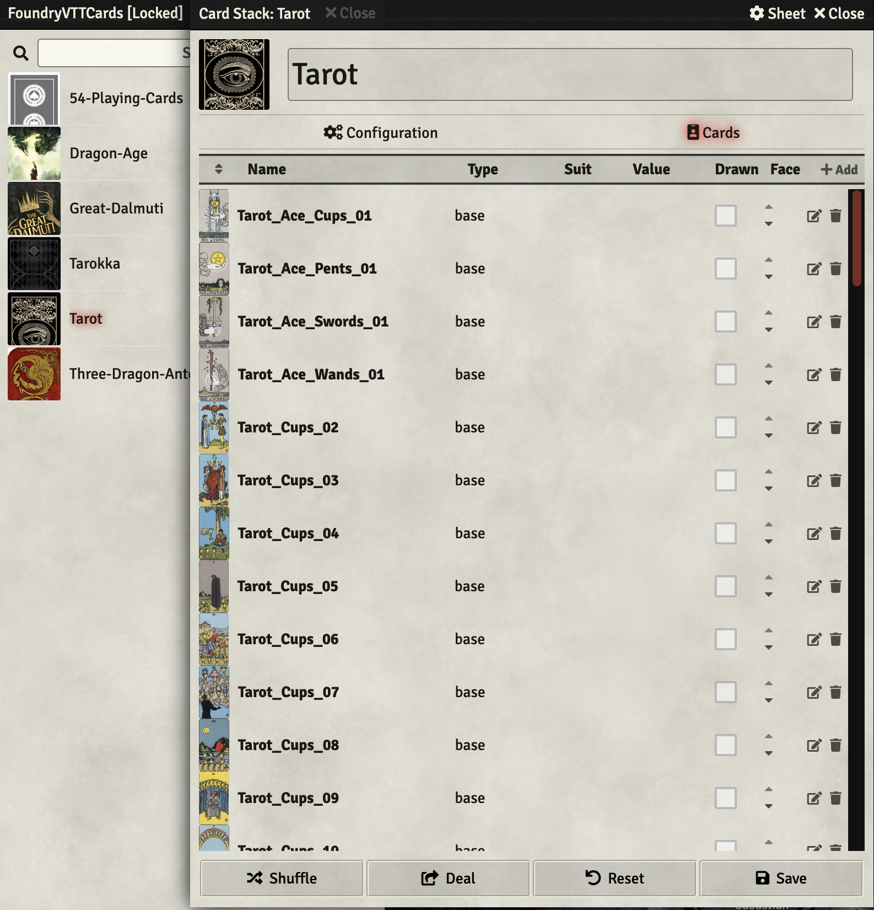

# Cards by Kaciquehn

Additional card decks for Foundry VTT v13.

- The Great Dalmuti
- 54 Playing Cards (standard 52 card deck + 2 Jokers)
- Three Dragon Ante
- Tarot Card Deck
- Dragon Age Deck
- Tarokka Deck

## To install in Foundry VTT v13

- Go to the **Setup** area of Foundry VTT.
- Click on the **Add-on Modules** tab.
- Click on the **Install Module** button.
- Paste this URL in the **Manifest URL** field:

```text
https://raw.githubusercontent.com/Kciquehn/Cards-by-Kaciquehn/refs/heads/main/module.json
```

- Click on the **Install Module** button.
- Restart Foundry VTT.
- Enable **Cards by Kaciquehn** in your world.

All the new card decks will be available for you to import from a compendium with the name **Cards by Kaciquehn**.

Happy Gaming!



## Credits

Originally created by Jay Colson as FoundryVTT Cards. This continuation is maintained by Kaciquehn with permission.

## Development

The Foundry package id is `cards-by-kaciquehn`. For local development, keep the module folder at:

```shell
Data/modules/cards-by-kaciquehn
```
